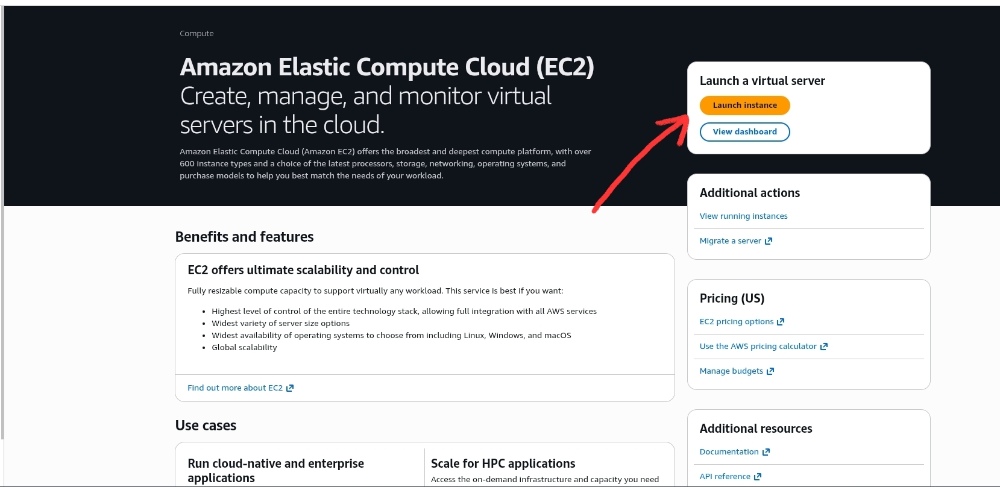

TODO: write

> This article describes AWS machine configuration. If you don't have access to
> AWS, feel free to move to next article.

TODO: remove points below

If you want to configure remote machine with AWS, you can go with EC2 service.
Now, the first tricky part is - what machine to choose? There are tons of
options and it's very easy to get lost there. It really depends on the projects
you plan to work on. You can use EC2 pricing calculator to determine what will
be the total cost depending on selected RAM and CPU. EC2 offers various machine
types depending on the specifics of your workloads. For example there are CPU
oriented machines for high CPU usage and machines for 'burst' type of workloads
where they don't need to run at full speed 100% of the time. For programming
purpose I suggest `m8i` or `m8g` machines (or newer generations if they are
available). These are intel (x86 architecture) and graviton (ARM architecture)
based machines with balanced parameters (cpu and memory) that for me seem very
well suited for the specific of software engineering workloads. The only thing
that you need to figure out is how much RAM and CPU do you need. I believe for
most cases machine like `m8i.2xlarge` is more than sufficient (32gb ram, 8 vCPU,
256 gb disk space). Since we will code in terminal RAM won't be occupied by any
GUI which already allows to get even more out of your machine.

Follow these steps to configure your machine:

- Log into AWS console
- Navigate to EC2 and click `Launch instance`
  

- Now select `Debian` as OS
- Setup security group, add a target ssh port that we need to unblock
- Keep in mind that aftet finishing secure of our server we need to remove
  default ssh port from security group
