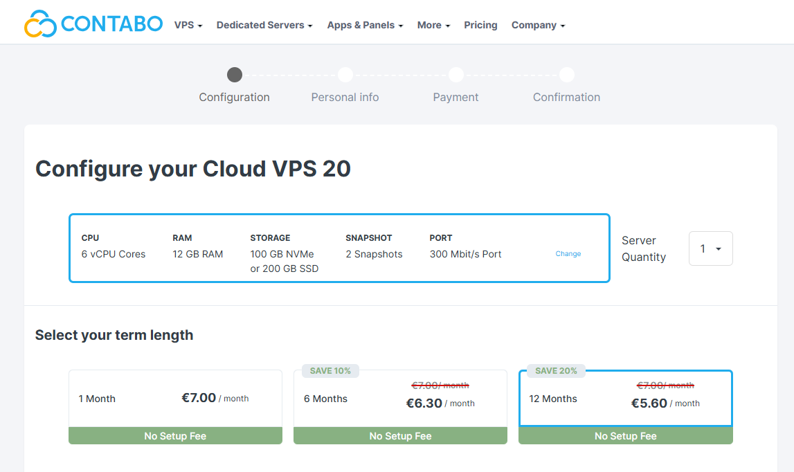
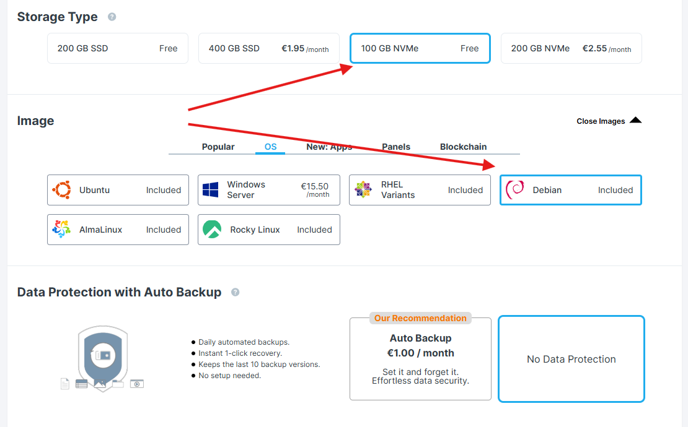
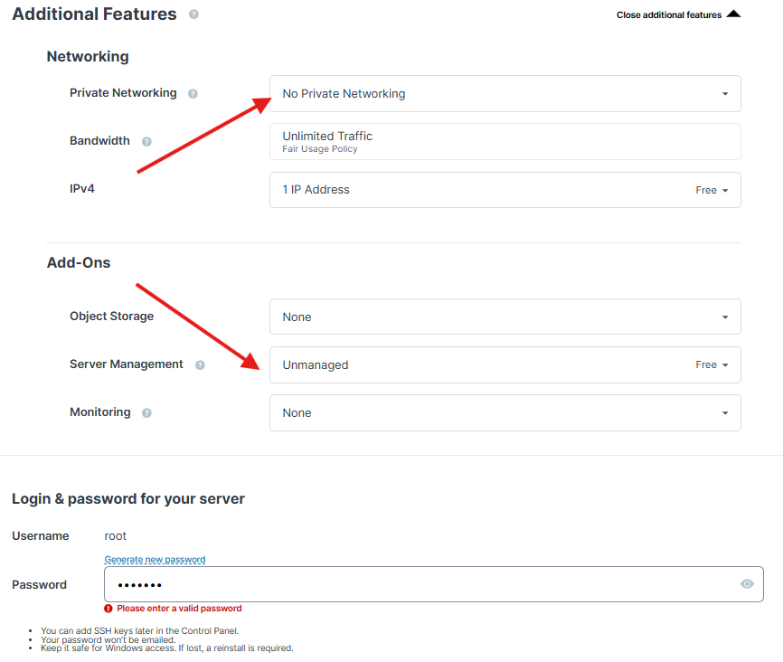
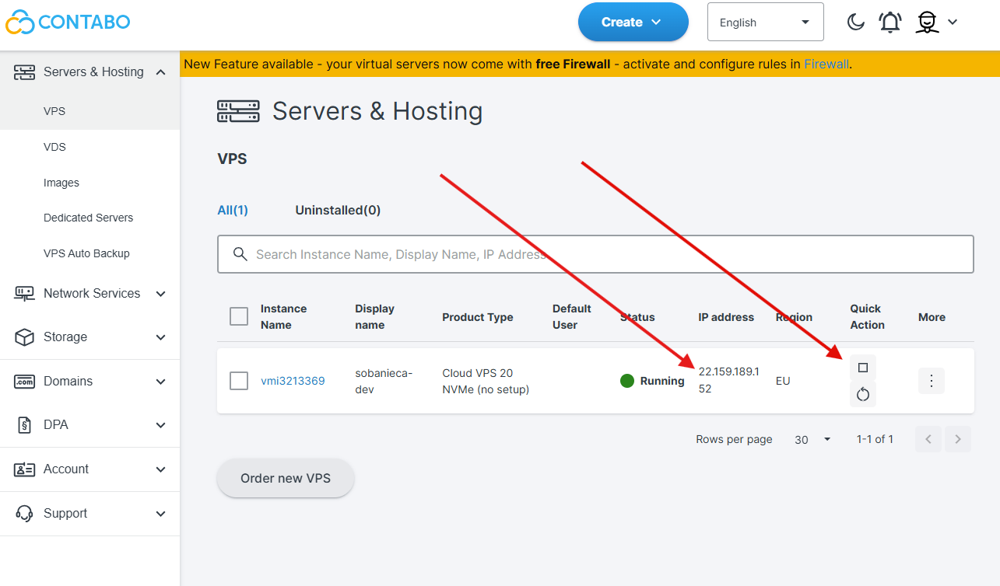

> This article describes Contabo machine configuration. If you want to use
> different provider, feel free to move to next article.

So you've decided that you want to setup machine with so called budget
providers? Contabo IMHO is a good choice. I use it personally to write this
article.

To spin up your machine go to [Contabo website](https://contabo.com/en/vps/) and
choose the VPS with right parameters for you. Then click `Get Started`

By default `Contabo` suggest yearly plan which allows for additional savings.
Choose whatever suits you:

Then choose disk space and OS:

In my case, for 'pet projects' 100 GB with fast disk is sufficient. Depending on
your use case you may need more though. Debian is my default OS for software
development. If you have other preferable system you may need to adjust some
code snippets I will provide on this page.

I don't use `Auto Backup` - this machine is serving purely for development and
source code is secure on external GIT servers anyway. It's not a big deal to
recreate machine anytime (especially once you have some scripts for it).

When you scroll down you will see `Additional Features`. In my case I don't use
private networking. This would require additional VPN setup which sounds like an
overkill for this specific purpose.. Also, I use `stop` functionality to turn
the VPS off when I don't use it (as additional layer of security). I will more
on improving security in
[Connect and Secure VPS](./2026-03-02-connect-and-secure-vps.md) which should
give some more details on how you can secure your VPS and let you decide if you
should or shouldn't use private networking.

Provide some valid password for your root user.

Then proceed to order details and payment. After all steps are completed you
should gain access to [Contabo customer panel](https://new.contabo.com):

Note two important thing here:

- You can stop your machine whenever you're not using it. That's what I
  recommend doing - this will increase security of your VPS. When it's not
  running no one can access it.
- You need to note it's IP address - it will be needed for SSH connection.

> Keep in mind that with setup presented here you VPS can be reached from any
> location. If you don't secure it properly and run some application that
> exposes some port like `3000` (let's say React application), anyone may access
> it by browsing to {VPS ip}:3000.
