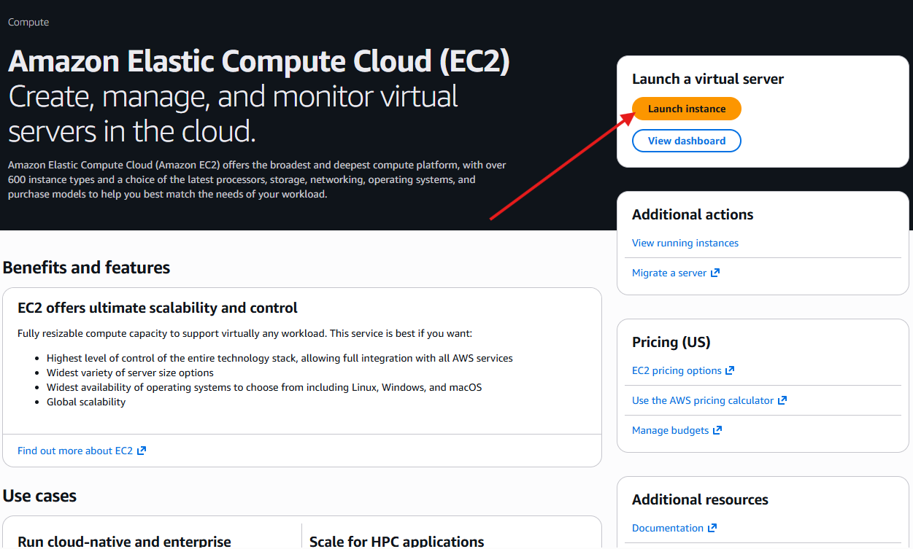
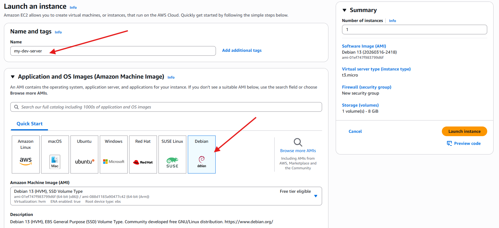
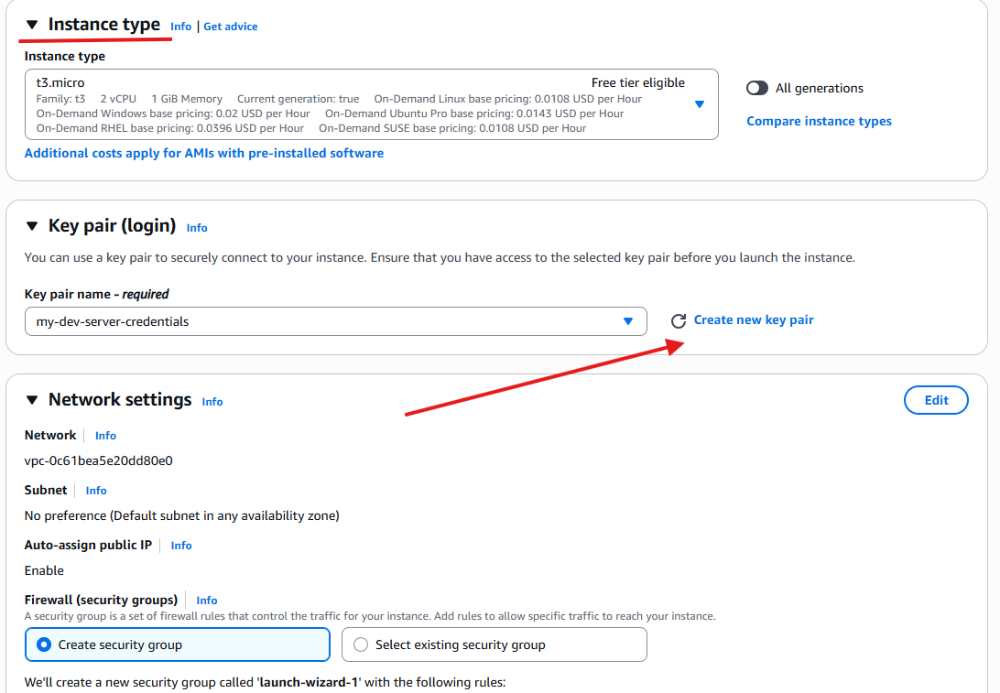
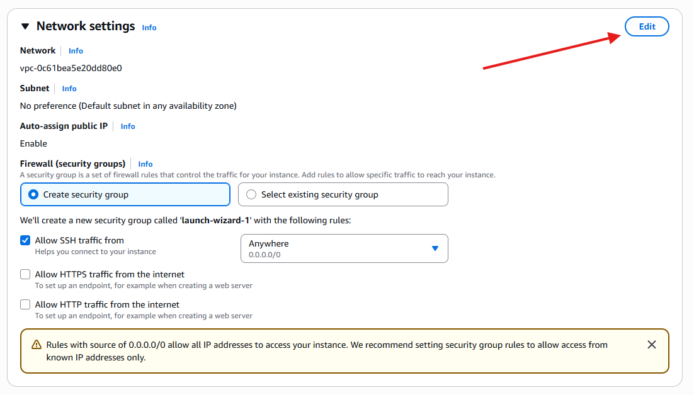
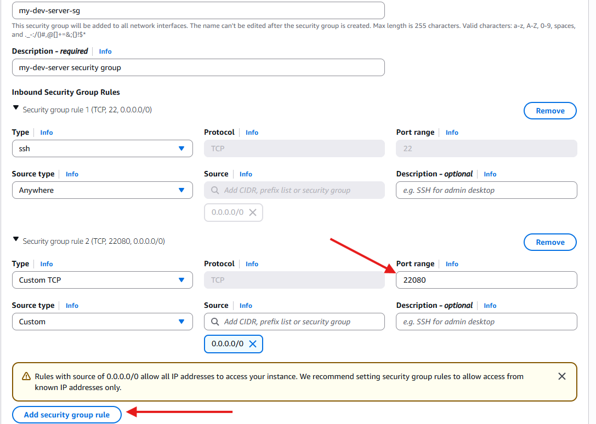
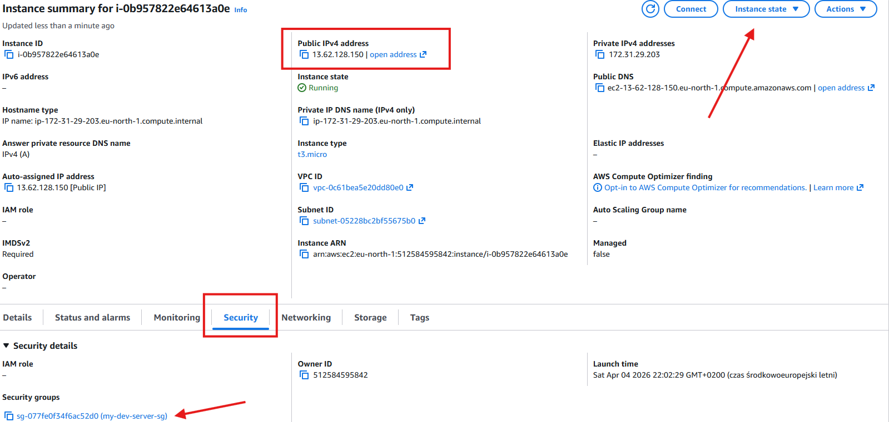

> **Note:** This article covers AWS machine configuration. If you don't have
> access to an AWS account or prefer another provider, feel free to skip to the
> next article.

If you want to configure a remote development machine on AWS, the EC2 service is
your best bet. The first tricky part is deciding which machine to choose. With
tons of options available, it's easy to get lost, but it really comes down to
the projects you plan to work on.

## Choosing the Right EC2 Instance

EC2 offers various machine types tailored to specific workloads. For example,
there are CPU-oriented machines for intensive processing and "burstable"
machines for workloads that don't need to run at full capacity 100% of the time.

For general programming purposes, I highly recommend the **`m8i`** (Intel/x86
architecture) or **`m8g`** (Graviton/ARM architecture) machines, or their newer
generations if available. They offer a great balance of CPU and memory, making
them perfectly suited for typical software engineering workloads.

The only thing left to figure out is how much RAM and CPU you actually need.
Since we will be coding in the terminal, your RAM won't be weighed down by a
graphical user interface (GUI), allowing you to get even more performance out of
your machine.

To give you a brief idea about costs — `m8i.2xlarge` instance (8 vCPU, 32 GiB
RAM) with about 6–7 hours of daily usage during working days should cost around
60 USD. You can expect that `m8i.xlarge` (4 vCPU, 16 GiB) will cost roughly half
of that (~30 USD), and `m8i.large` (2 vCPU, 8 GiB) around ~15 USD.
Graviton-based instances (`m8g`) are more affordable if your projects don't
require x86 architecture.

_Use the [AWS Pricing Calculator](https://calculator.aws/) to determine the
exact total cost based on your specific needs._

---

## Step-by-Step Configuration

Follow these steps to launch and configure your machine:

1. **Log in** to the AWS Management Console.
2. **Navigate to EC2** and click the **Launch instance** button.
   
3. **Name your instance** and select **Debian** as the OS (this is what I use
   and recommend for this setup).
   
4. **Select your instance type.** As mentioned above, the `m` series is
   generally sufficient for development. You must also **Create a new key pair**
   to securely access your machine. Download the key file and store it in a safe
   place. 
5. **Edit Network Settings.** Scroll down to the network settings section and
   click **Edit**. 
6. **Configure Security Group.** For security reasons, it's best not to use the
   default SSH port (22) permanently. Click **Add security group rule** and
   input a custom port number that you plan to use instead.
   

> **Important:** Keep the default SSH port (22) open for now. You will need it
> for your initial connection. In an upcoming article, I will show you how to
> configure a custom SSH connection on your server. Once that is done, you can
> safely remove port 22.

7. **Launch.** Click **Launch instance** in the summary panel. After a short
   wait, your server will be ready.
8. **Review Instance Details.** Navigate to the details page of your new
   machine. 

Pay attention to three critical tabs and values on this screen:

- **Public IPv4 address:** This is the IP you will use to connect to your
  machine.
- **Instance state:** This allows you to control your machine's lifecycle. Get
  into the habit of stopping it when you don't need it and starting it on
  demand—this helps save significantly on costs!
- **Security:** This tab allows you to find and manage your associated security
  group. You will return here later to remove the default SSH port rule after
  adjusting your server settings.

Proceed to the next articles to find out how to establish a connection and
configure your new server!
