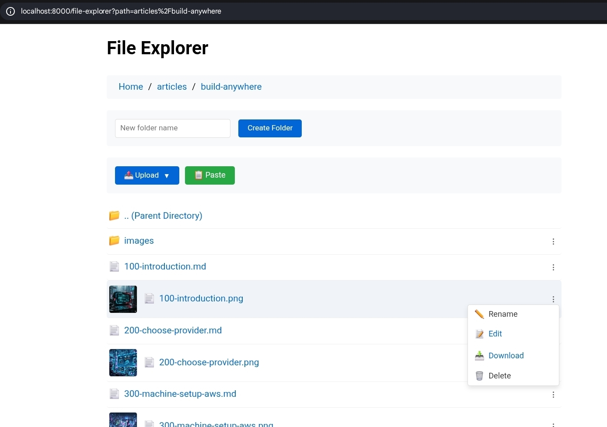

So now you have your machine configured and ready to start coding. There are a
few things you need to keep in mind when utilizing such a remote setup.

# Port forwarding

## Accessing remote services

This is essential. Whenever you run your backend that listens on, let's say,
http://localhost:8000 and you try to reach it from your local machine it won't
be available (and it shouldn't!). In order to access it you need to set up port
forwarding the moment you connect to the remote machine. Use the `-L` parameter
for this. For example, for the alias defined in the previous article:

```bash
ssh -L 8000:localhost:8000 -o TCPKeepAlive=yes -o ServerAliveCountMax=20 -o ServerAliveInterval=15 -q -p {ssh_port} -i ~/.ssh/id_rsa {user}@{IP or DNS}
```

As a result, you can access your service as if it were running directly on your
machine!

> **Note:** There is no need to update firewall rules. A single port (the SSH
> port) is used and acts as a connection tunnel.

The main drawback here is that you need to know in advance what ports you need
when making the connection. Especially when you work on a large project, this
may be an issue. In my case, discipline works - each time I discover yet another
port, I keep updating my connection alias/script. After that, I run another
parallel ssh connection. The ssh tool is smart enough to extend the setup by
just one more port.

There are some situations when on your remote machine you will see a very
temporary port open. For instance, during MCP authentication in tools like
Claude Code. I haven't tried it yet, but there is a possibility to extend an
established ssh connection with one more port. For now, I do the same as
described above - just initiate another ssh connection, since I rarely have to
do it.

Believe it or not - with port forwarding it's possible to run a big project with
Vite for the frontend and some Node.js backend with orchestrators like
Nomad/Kubernetes completely on a remote server.

---

## Exposing local services to remote

There may be a situation where you have to expose some service on your machine
to the remote machine. For example, you may want to expose your Chrome with
remote debug so that Claude Code can connect to it via Chrome MCP. In this case
you need to define the `-R` parameter:

```bash
ssh -R 9222:localhost:9222 -o TCPKeepAlive=yes -o ServerAliveCountMax=20 -o ServerAliveInterval=15 -q -p {ssh_port} -i ~/.ssh/id_rsa {user}@{IP or DNS}
```

With such a connection, whenever you run Claude Code on the remote machine, it
can access your local Chrome as if it were running on the remote machine.

---

# Transferring files

There is one more important issue to solve when working on a remote machine. How
to transfer files from my local machine to the remote one? It's very common that
we download some assets that we need to include in the source code. There are
lots of ways to solve this, but in my case I wanted something very simple. I was
looking for a tool that would allow me to navigate to a specific directory on
the remote server, run a single command, and as a result have a file server
started for the given working directory. I couldn't find anything like this.
That's why I've decided to vibe code my own `remote-file-manager`
([link](https://github.com/sobanieca/remote-file-manager)).

It's not the ultimate solution, but it works very well for me. Let's say I've
downloaded some image that I need to include in my project. I just navigate on
my remote machine to the directory where I want to upload it:

```bash
cd ~/code/my-project/assets
```

And run the `rfm` command there. From now on, I can navigate to
`localhost:8000/file-explorer` to see files within the given directory:



> Built-in file explorer is very handy for transferring files between machines

It's possible to edit text files (which is also useful when I need to copy &
paste some text content between the local and remote machine). This is a very
basic application, but it completely serves its purpose for me. It also has some
neat features, like pasting a screenshot directly from the clipboard.

What's more - it acts as an HTTP server! I can serve HTML pages easily. So
whenever I navigate to `localhost:8000`, it will search for an `index.html` file
inside the working directory where `rfm` was started.
