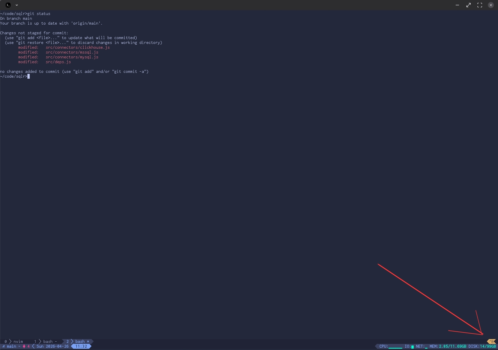

With the emulator and font in place, the next problem appears quickly: a single
terminal window is rarely enough. When moving to a terminal-based workflow I was
searching for an effective way of managing multiple applications. For instance,
it's very common to have an IDE (Neovim) running alongside some backend logs and
a separate terminal for running/stopping the application. Having it all on a
single screen boosts productivity.

There are plenty of terminal emulators that offer such features (Windows
Terminal, Warp, Termux, Kitty, Alacritty), but I was looking for something that
works directly on the remote machine (when connected to remote VPS). This way I
don't get used to a particular device or OS that I use to connect to the
machine. No matter if I use a PC or smartphone, I can split the terminal using
the same keyboard shortcuts.

`tmux` ([link](https://github.com/tmux/tmux/wiki)) is the tool of my choice. It
makes it easy to spawn new terminal windows whenever I need to run a process,
check logs, or do something else. `ctrl+space`, then `v`, and my terminal is
split in half with another terminal ready to run more commands.

`tmux` has one more outstanding feature: it's easy to return to an established
session. If for any reason my tmux session is interrupted (when working on a
remote machine this often means a dropped connection), I can simply run
`tmux attach` to land exactly where I left off.


> With `tmux` it's easy to switch to another 'thread' and continue work. You can
> split the terminal and move to another tool to accomplish a given task.

## Tmux plugins

### Managed via plugin manager

In most cases the default `tmux` installation won't be enough. To enjoy working
with it, you have to introduce some customization. First of all, there are a few
`must-have` plugins that I suggest everyone install. But before installing
plugins we need a `tmux` plugin manager (unfortunately, AFAIK `tmux` doesn't
have native support for plugins). For this I recommend
[Tmux Plugin Manager](https://github.com/tmux-plugins/tpm). The whole
installation is rather straightforward:

```bash
# Install Tmux
echo "Installing tmux..."
sudo apt-get install tmux -y
if [ ! -d "$HOME/.tmux/plugins/tpm" ]; then
  git clone https://github.com/tmux-plugins/tpm $HOME/.tmux/plugins/tpm
fi
echo "Tmux installed."
```

Two plugins that I use with `tpm` (and recommend) are:

- Extrakto ([link](https://github.com/laktak/extrakto)) - allows you to select
  text without using the mouse:


> No need to use the mouse to copy & paste parts of the text visible on screen.

- Tmux Prefix Highlight
  ([link](https://github.com/tmux-plugins/tmux-prefix-highlight)) - displays a
  visual indicator in the status bar when the `tmux` prefix key is pressed.



> This small symbol in the lower right corner indicates that the `tmux` prefix
> key was pressed and `tmux` is waiting for an additional keystroke.

### Gitmux

There is one more plugin which is (IMHO) a `must-have` -
[gitmux](https://gitmux.com/). It displays git status in the tmux status line,
which gives a quick overview of the current branch and the amount of changes. I
can't imagine working without it!

## Configuration

As I've mentioned, I use a highly customized tmux with custom key bindings.
Pre-AI, it allowed me to take a quick look at my `tmux.conf` file to see what
key shortcuts are available. I've also removed key shortcuts I don't use. If you
want to take a look at my config in `env-setup` repository -
[tmux.conf](https://github.com/sobanieca/env-setup/blob/master/tmux.conf). It
contains quite a bit of setup. It should be fairly easy to elaborate on each
setting using AI, so I don't see the point in explaining everything here. You
can use it as inspiration for a custom setup that works well for you.
