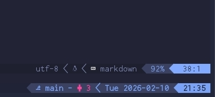

Have you ever envied those "hackers" in movies who seem to achieve impossible things just by typing into a black screen? While Hollywood dramatizes it, there is a profound truth beneath the surface: the terminal is the most efficient interface for creation.

I had following key reasons to migrate my entire development workflow inside the terminal:

- **The Mobile Advantage:** When I started exploring coding on my phone, it became clear that a GUI environment wasn't feasible. On a small screen, you need to maximize every pixel.
- **Work on Remote Machine:** SSHing into a remote server is far more efficient than streaming a GUI via Remote Desktop. 
- **Automation Potential:** I was fascinated by the enormous potential for automation. Tasks that required tedious clicking in a GUI can easily be transformed into bash scripts. In the age of AI, this synergy is even more powerful—AI agents thrive in text-based environments.
- **The Flow State:** Minimizing mouse usage isn't just a physical preference; it’s a productivity multiplier. Staying on the keyboard keeps your hands in place and your mind focused. It removes the friction of context switching between the keyboard and the mouse, making the work feel remarkably smooth.

If these reasons resonate with you, it's time to take the plunge. But where do you start?

### The Foundation: A Terminal Emulator

Everything begins with your terminal emulator. Depending on your operating system, you need an application that is fast, customizable, and reliable. As a Windows and Android user, my daily drivers are **Windows Terminal** and **Termux**, respectively.

### The Visuals: Nerd Fonts

Once you have your emulator, there is one crucial ingredient: [Nerd Fonts](https://www.nerdfonts.com). These fonts don't just display text; they include thousands of icons that transform the terminal from a dry console into a modern IDE. These icons are essential for visual cues in file explorers, status lines, and prompt themes.



> *Example of a Nerd Font in action—notice how the icons fit perfectly into a single character space.*

#### Installation

**On Windows Terminal:**
Install your preferred Nerd Font (I personally recommend **Inconsolata Go**) in your OS settings. Then, in the Windows Terminal settings, navigate to your profile's "Appearance" section and select the font.

**On Termux (Android):**
You need to manually place the font file at `~/.termux/font.ttf`. Here is a quick way to do it:

```bash
wget https://github.com/ryanoasis/nerd-fonts/releases/download/v3.0.2/InconsolataGo.zip -O font.zip
unzip font.zip
mv InconsolataGoNerdFontMono-Regular.ttf ~/.termux/font.ttf
# Then run: termux-reload-settings
```

I personally recommend [Inconsolata Go](https://www.programmingfonts.org/#inconsolata-go) for its clarity and balance. Once you have your font set up, you're ready to start building your environment.
