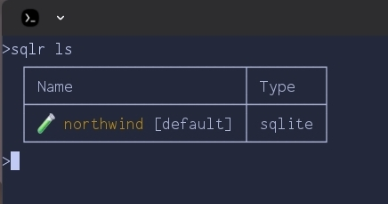
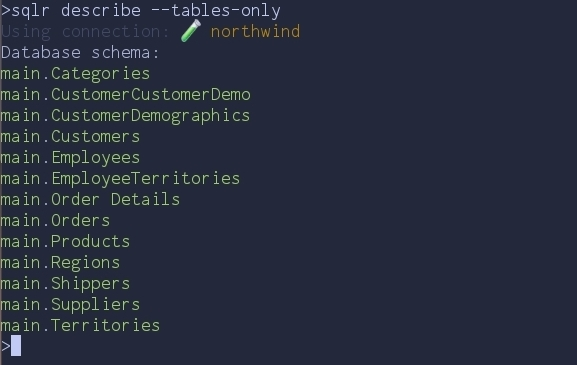
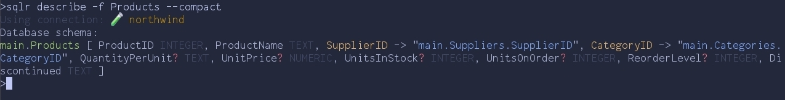
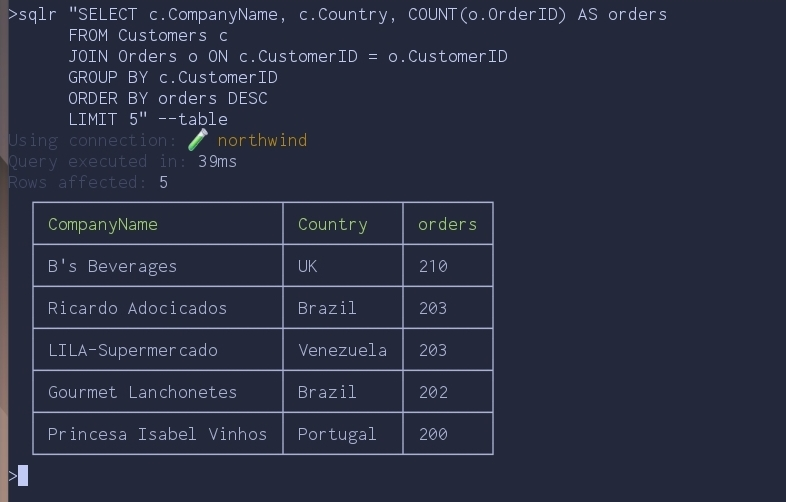
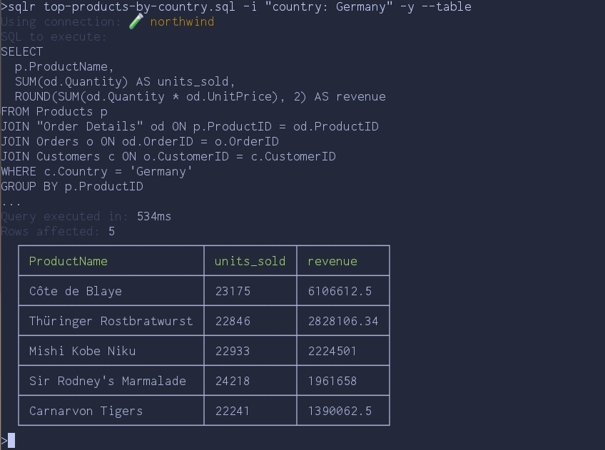

A few years ago, while working on a .NET project, I frequently had to inspect
data in a SQL Azure database. Opening SQL Management Studio each time, waiting
for it to load, connect, and finally accept a query, got old fast. I started
looking for a simple CLI tool I could script against — something with JSON
output and a manageable list of connections. I didn't find anything that fit, so
I built [sqlr](https://github.com/sobanieca/sqlr).

It lets you define and manage connections from the CLI. Once a connection is set
up, querying the database is as simple as
`sqlr query "select * from main.users"`.

**Why `sqlr`?**

- **Lightweight & focused:** A handful of commands — `add`, `describe`, `query`.
  You learn it in minutes.
- **JSON-first output:** Results are JSON by default, so they pipe straight into
  `jq`, scripts, or another tool. `--table` and `--compact` flags are there when
  you want to read them yourself.
- **One CLI, multiple databases:** PostgreSQL, MySQL, MSSQL, ClickHouse and
  SQLite — all behind the same commands.
- **Connections scoped to the git repository:** `sqlr` walks up from the current
  directory looking for a `.git` folder. Connections defined inside a repo stay
  with that repo. No accidental cross-project queries.
- **Encrypted at rest:** Connection strings can be encrypted with a password.
  `SQLR_ENCRYPTION_PASSWORD` lets scripts and AI agents decrypt without
  prompting, while the secret never lives in plaintext on disk.
- **SQL files with variables:** A `.sql` file with `{{placeholders}}` is a
  versionable artifact — commit it next to the code that depends on it, then run
  it with `-i "key: value"`.

Let's see it on example of SQLite database:

### Setting up

I'll use the
[Northwind sample database](https://github.com/jpwhite3/northwind-SQLite3)

```sh
sqlr add -n northwind -t sqlite -s ./northwind.db
```

(You can also run `sqlr add` with no arguments to walk through an interactive
wizard.)

Pin it as the default for this directory so we can drop `-n` from every command
that follows:

```sh
sqlr set northwind
```

A quick sanity check:

```sh
sqlr ls
```



> If you run `sqlr add` interactively, you'll also be asked to pick an icon and
> color so each connection is easier to spot at a glance.

The connection is stored — but only for this directory. Because we're inside a
git repository, `sqlr` scoped both the connection and the default to the repo.
Move outside and `sqlr ls` will show a different (likely empty) list. This is
deliberate: each project carries its own database connections, and you won't
accidentally fire a query at production from an unrelated checkout. Teammates
cloning the repo just add their own local connection and run `sqlr set` once. If
you do want a connection available everywhere, add it with `-g`.

To clear the default later, run `sqlr set` with no arguments.

### Exploring the schema

Before writing any SQL, let's see what's inside. `sqlr describe` prints the full
schema; for a quick overview, ask only for table names:

```sh
sqlr describe --tables-only
```



> `--tables-only` gives a quick overview of every table without the column-level
> noise.

Thirteen tables — a classic order-management schema. Let's drill into `Products`
with `--compact` and a filter:

```sh
sqlr describe -f Products --compact
```



> `--compact` packs the same information into as little space as possible.

A few things to notice in that one line:

- `?` marks nullable columns.
- Foreign keys render as `Column -> "target.table.column"`, so the join graph is
  right there in the output.
- One row per table means it pipes cleanly into other tools and reads well in an
  LLM context. Use `--table` when you want a human-friendly grid instead.

That's enough to start writing real queries — we know which tables exist, which
columns are nullable, and how they connect.

### Running queries

The `query` keyword is optional — anything `sqlr` doesn't recognise as a command
is treated as SQL. So this works:

```sh
sqlr "SELECT c.CompanyName, c.Country, COUNT(o.OrderID) AS orders
      FROM Customers c
      JOIN Orders o ON c.CustomerID = o.CustomerID
      GROUP BY c.CustomerID
      ORDER BY orders DESC
      LIMIT 5" --table
```



`--table` is the human-friendly view. Drop it and you get JSON, which is what
you actually want once a query graduates from interactive exploration to
something a script (or AI agent) consumes.

### Versioning queries: SQL files with variables

Inline SQL is fine for one-offs, but the moment a query gets useful you want it
in git. `sqlr` runs `.sql` files directly and supports `{{variable}}`
placeholders that get filled from the command line.

Save this as `top-products-by-country.sql`:

```sql
SELECT
  p.ProductName,
  SUM(od.Quantity) AS units_sold,
  ROUND(SUM(od.Quantity * od.UnitPrice), 2) AS revenue
FROM Products p
JOIN "Order Details" od ON p.ProductID = od.ProductID
JOIN Orders o ON od.OrderID = o.OrderID
JOIN Customers c ON o.CustomerID = c.CustomerID
WHERE c.Country = '{{country}}'
GROUP BY p.ProductID
ORDER BY revenue DESC
LIMIT 5;
```

Then run it:

```sh
sqlr top-products-by-country.sql -i "country: Germany" -y --table
```



A few things worth calling out:

- `-i "key: value"` fills each `{{key}}` placeholder. Pass `-i` multiple times
  for multiple variables.
- `sqlr` previews the SQL it's about to execute and asks for confirmation when
  running a file. `-y` skips the prompt — useful in scripts, omit it for
  anything destructive you want to eyeball first.
- If the file references `{{key}}` but you forget `-i`, `sqlr` refuses to run
  rather than firing a query with literal `{{key}}` in it.

The file is now a versioned, parameterised artifact. Commit it next to the code
that depends on it, share it with your team, schedule it from cron — same query,
different inputs, no copy-paste.

### Piping into scripts: JSON output

Once you drop the `--table` flag, results come out as JSON. Add `-o` to write
them straight to a file:

```sh
sqlr "SELECT c.Country, COUNT(o.OrderID) AS orders
      FROM Customers c
      JOIN Orders o ON c.CustomerID = o.CustomerID
      GROUP BY c.Country
      ORDER BY orders DESC
      LIMIT 3" -o orders-by-country.json
```

The resulting `orders-by-country.json`:

```json
[
  { "Country": "USA", "orders": 2280 },
  { "Country": "France", "orders": 1909 },
  { "Country": "Germany", "orders": 1895 }
]
```

From here it's just JSON — `jq` it, post it to Slack, drop it in a daily report.
The point is that there's no parsing layer between you and the data; the CLI
hands you a structure, not text you have to scrape.

### Using `sqlr` with AI agents

Structured JSON output is also what makes `sqlr` work well with AI agents.
There's no MCP server to install, no separate adapter, no schema layer to keep
in sync. Drop the binary in the agent's environment, and a prompt like:

> run `sqlr help` and list all tenants signed up in the last 3 days

is enough. The agent reads `sqlr help`, lists connections with `sqlr ls`, learns
the schema with `sqlr describe --compact`, and writes the query. The same three
steps you would run yourself, just typed by something else.

### Conclusion

`sqlr` exists because I wanted a single small CLI for the database tasks that
otherwise pull me into a GUI. Define a connection once, set it as the default,
describe the schema, query it, version the useful queries as `.sql` files, pipe
results into other tools — that's most of what I do with a database day-to-day,
and now it lives in the terminal next to everything else.

[https://github.com/sobanieca/sqlr](https://github.com/sobanieca/sqlr)
