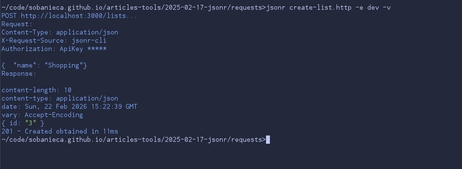
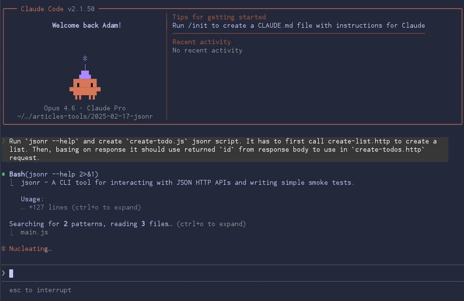

Few years ago, after another Postman update that resulted in much slower startup
and overload of features in UI I've decided to search for some alternative. I've
discovered that some of my team mates are using http files and proper extension
within Visual Studio Code. Since I was already in transition period to move
entirely into terminal workflow, I knew I need to find similar tool that has
proper CLI. `curl` was way too complex for me and didn't support http files. The
idea of having repository with http requests to serve as collection was very
attractive. Since I couldn't find proper tool I've decided to build it on my
own.

One may say that it doesn't make any sense especially in AI era where we can interact with API's with natural language. I don't agree, from my experience -
there is always some need interact with API's. Not all operations in system have proper GUI built-in. Sometimes it's simply cheaper and makes more sense to keep
some endpoints only. In this case there is always a need to have specific structure of the request stored somewhere. Collection of http files sounds
like the best solution. One can keep it under GIT version control and have proper change history and update it together with some related backend changes. 
So why not to simply ask AI to translate http file it into `curl`? The answer is simple - leaking secrets. What I find optimal solution is
to have a strict collection of http files, then some environments defined and simple tool that will merge both and make API request ensuring that no secrets
leak to the LLM.

Leaking secrets is a problem also when interacting with API during pair-programming sessions or some presentations. Of course, this is an issue only for terminal flow. Many GUI http clients already mask secrets properly.

I present to you `jsonr` - the CLI tool that allows you to interact with JSON
API's - https://github.com/sobanieca/jsonr

What's so special about it?

- It's lightweight and simple to use. You only need few minutes to learn about
  it's features. Also, if you use AI agents provide them output from
  `jsonr --help` and they should easily build proper command/http file for you
- It has built-in `secrets` handling so your API keys won't leak whenever you
  ask LLM to make some API request for you or you screen share.
- It encourages you you to use http files. That way, one can keep various
  requests next to the proper API git repository. It allows to share requests
  amongst other developers
- Once requests are properly setup, it's very easy to switch environments and
  with minimal effort make requests to PROD
- It is powered by Deno which means `jsonr` has runtime capabilities built-in
  (!). You can write simple Javascript scripts on top of existing http files and
  chain various requests.
- You can write simple smoke tests with it

It doesn't aim to solve all possible problems out there. It's supposed to handle most (many?) of the common issues when manually interacting with API's. That's why it
is and will remain as simple to use as possible.

Let me provide you an example on how this tool may improve your flow. Let's imagine that you're working on a to-do list app. From time to time you need to test
something on your sandbox environment. Instead of clicking through GUI, you can define creating a new list with `create-list.http` file:

```http
POST @@baseUrl@@/lists
Authorization: ApiKey @@apiKey@@

{
    "name": "my-list"
}
```

Then you can populate it with some todo items:

```http
POST @@baseUrl@@@/lists/@@listId@@/todos
Authorization: ApiKey @@apiKey@@

[
  {
    "content": "Buy milk",
  },
  {
    "content": "Buy eggs"
  }
]
```

If you would try to run any of this files with `jsonr` you would notice:


`jsonr` detects that within `http` file there is some `@@variable@@` and expects that you provide it. This is to ensure that you won't accidentally `PUT/POST`
some undesired variables.

Now we need to run `jsonr config --init` to initialize configuration file and adjust it according to our needs:

```json
{
  "environments": {
    "dev": {
      "inputVariables": {
        "baseUrl": "http://localhost",
      },
      "secrets": "~/.secret/dev-secrets.json"
    },
  },

  "defaults": {
    "headers": {
      "X-Request-Source": "jsonr-cli",
      "Authorization": "ApiKey @@apiKey@@"
    }
  }
}
```

Please note how config file is structured. It allows you to define environment specific settings, but also specify some defaults. What is also worth noting that
`jsonr-config.json` resolution works similarly to `package.json`. It will resolve it up to `HOME` directory and merge all settings. This is really flexible
solution that allows to define some shared settings across different API's. Run `jsonr --help` to see all possible configuration options.

Please note also `secrets` property. It allows you to define secret values that you don't want to leak anywhere. The underlying logic in `jsonr` is very simple.
It removes it from output logs by replacing it with `*****`. Secrets file itself is simple json file with map of values:

```json
{
    "apiKey": "someKey123"
}
```

Let's run the `create-list.http` request now to see how it works:



Please note how API key is masked so it doesn't leak. No more worries that LLM's know too much! No problem with screen sharing during pair programming. 

Summary:

Sure, it may take some time to setup all http files and environments. But it's one time job that pays off in future when you need to repeat acting with some
API's. If you're like me and want/already use terminal for your daily professional work I suggest you to give it a try.

> NOTE: I'm not aware about any specifc HTTP file specification that would enforce specific syntax for environment variables or comments. That's why `jsonr`
> comes with it's own interpreation using `@@variable@@` and `# comment` syntax. In future this may change to match future specification.

Let's check on another feature of `jsonr`. As you've noticed to create todo we need to provide list id. We may provide it manually when typing command (using
`-i "listId: 1"` parameter) but there is better way. We can create `jsonr` script. You can write simple `Javascript` file to chain multiple requests:

Let's make some use of AI here. For instance for following prompt:



It created following script `create-todo.js`:
```js

```


