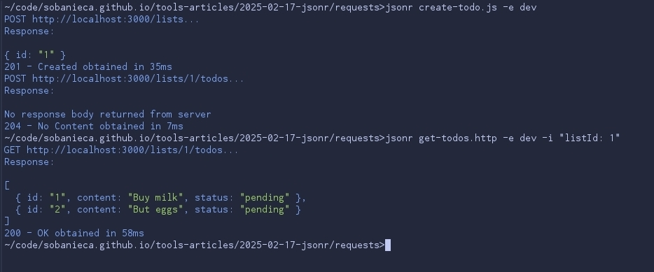

A few years ago, after yet another Postman update resulted in a slower startup and a UI overloaded with features I didn't need, I decided to look for an alternative.

I noticed teammates using `.http` files within Visual Studio Code. It was a clean approach—keeping requests in the repository, versioned alongside the code. However, I was in the middle of a transition to a terminal-centric workflow. I needed a tool that offered that same simplicity but lived in the CLI. `curl` was powerful but too verbose for maintaining collections, and it lacked the structural benefits of `.http` files.

I couldn't find the perfect tool, so I decided to build it.

### The Case for CLI in an AI World

One might argue that manually crafting HTTP requests is obsolete in an era where we can just ask an AI to "call the API." I disagree.

Not every system operation has a GUI, and sometimes, sending a raw request is simply the most efficient path. More importantly, we need a way to store and share these request structures without compromising security.

Asking an AI to "translate this HTTP file to curl" works, but it often invites a critical risk: **leaking secrets.** When you paste a request containing an API key into an LLM context, you've potentially compromised that credential. The optimal solution is a strict separation of concerns: a collection of request templates (`.http` files) and a tool that injects secrets from a secure, local source at runtime.

### Enter `jsonr`

I created `jsonr` to fill this gap. It is a CLI tool designed to interact with JSON APIs securely and efficiently.

[https://github.com/sobanieca/jsonr](https://github.com/sobanieca/jsonr)

**Why `jsonr`?**

*   **Lightweight & Simple:** You only need a few minutes to learn its features. It's built to be minimal and easy to adopt.
*   **Security First:** It handles `secrets` natively. Your API keys are injected at runtime and masked in outputs, ensuring they never leak to an LLM or a screen share.
*   **Version Control Friendly:** It encourages the use of `.http` files. This allows you to keep requests alongside your code in Git, making them easy to version and share with teammates.
*   **Scriptable:** Powered by Deno, `jsonr` isn't just a runner; it's a runtime. You can chain requests using JavaScript, enabling complex workflows and smoke tests.
*   **Environment Switching:** Seamlessly switch between `local`, `dev`, and `prod` environments with a simple flag.

It doesn't aim to solve all possible problems out there. It is supposed to handle most of the common issues when manually interacting with APIs. That is why it is and will remain as simple to use as possible.

### A Practical Workflow

Imagine you are building a To-Do list application. Instead of clicking through a GUI to test your backend, you define a `create-list.http` file:

```http
POST @@baseUrl@@/lists

{
    "name": "my-list"
}
```

And a subsequent request to populate it in `create-todos.http`:

```http
POST @@baseUrl@@/lists/@@listId@@/todos

[
  { "content": "Buy milk" },
  { "content": "Buy eggs" }
]
```

If you try to run these files directly, `jsonr` will pause. It detects the `@@variable@@` syntax and prevents you from sending a request with unresolved placeholders.


### Configuration and Secrets

To make this work, we initialize a configuration with `jsonr config --init`. This creates a `jsonr-config.json`.

```json
{
  "environments": {
    "dev": {
      "inputVariables": {
        "baseUrl": "http://localhost:3000"
      },
      "secrets": "~/.secret/dev-secrets.json"
    }
  },
  "defaults": {
    "headers": {
      "X-Request-Source": "jsonr-cli",
      "Authorization": "ApiKey @@apiKey@@"
    }
  }
}
```

This configuration system is designed for flexibility. `jsonr` looks for `jsonr-config.json` in the current directory and then traverses up the directory tree to your `HOME` directory. It merges these files as it goes.

This hierarchical approach is powerful. You can define global defaults (like a user-agent or shared secrets path) in your home directory's config, while keeping project-specific endpoints and environments in the repository's config.

The magic lies in the `secrets` property. It points to a file outside your repository (e.g., `~/.secret/dev-secrets.json`) where your actual keys live.

```json
{
  "apiKey": "someKey123"
}
```

When you run the request now, `jsonr` merges the template, the environment config, and the secrets. Crucially, it masks the sensitive data in the output.


### Scripting with JavaScript

Sometimes you need to chain requests—create a list, get its ID, and then add items to *that specific list*. While you could copy-paste the ID, `jsonr` allows you to automate this with a simple JavaScript file.

You can even ask an AI to generate the script for you based on your `.http` files:


The resulting `create-todo.js` might look like this:

```js
const listResponse = await jsonr("./create-list.http", {
  status: 201,
});

const listId = listResponse.body.id;

await jsonr("./create-todos.http", {
  inputVariables: { listId },
  status: 204,
});
```

Now when running it:



This script not only chains the requests but also asserts the status codes. If the API returns a 500, the script fails. You've just written a smoke test.

### Conclusion

If you prefer the terminal and want a robust way to manage API interactions without the bloat of a GUI, give `jsonr` a try.

[https://github.com/sobanieca/jsonr](https://github.com/sobanieca/jsonr)

It might take a moment to set up your environments, but the payoff is a fast, secure, and version-controlled workflow that lives right alongside your code.

> **Note:** I am not aware of any specific HTTP file specification that enforces a standard syntax for environment variables or comments. That is why `jsonr` implements its own interpretation using `@@variable@@` and `# comment` syntax. This may change in the future to align with emerging specifications.
